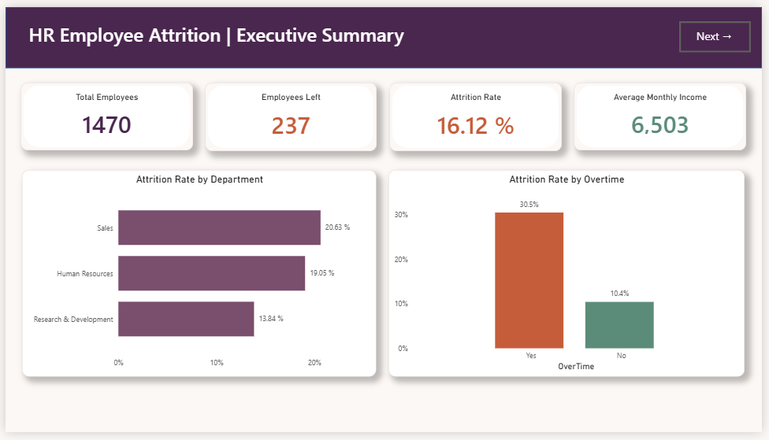

# Employee Attrition Analysis

## Project Overview

This project analyzes employee attrition using Python, SQL, and Power BI to identify workforce patterns that contribute to employee turnover. The analysis explores how factors such as age, overtime, pay, job role, and work-life balance influence attrition risk.

The project uses 1,470 employee records and develops a multi-page Power BI dashboard to communicate the findings clearly to business stakeholders.

## Project Objectives

- Clean and prepare employee data for analysis
- Analyze attrition patterns by demographic and job factors
- Use SQL to understand workforce trends and risk groups
- Build DAX measures and KPIs in Power BI
- Visualize attrition drivers and retention opportunities
- Deliver actionable insights for workforce planning

## Tools and Technologies

- Python
- Pandas
- MySQL / SQL
- Power BI
- DAX
- Power Query
- Jupyter Notebook

## Project Workflow

1. Imported and inspected the employee dataset in Python.
2. Cleaned and validated the records using Pandas.
3. Prepared the dataset for SQL analysis.
4. Ran SQL queries for demographic, compensation, and experience analysis.
5. Built Power BI measures and KPIs.
6. Designed an interactive dashboard with multiple views.
7. Identified high-risk employee segments and retention opportunities.

## Key Insights

- Employees aged 18–25 who worked overtime showed a high attrition risk.
- Attrition varied significantly by department, role, and compensation band.
- Work-life balance and engagement drivers strongly influenced retention.

## Dashboard Preview



## Repository Structure

```text
HR-Employee-Attrition-Project/
├── README.MD
├── data/
│   ├── Employee-Attrition.csv
│   ├── Employee_Attrition_Cleaned.csv
│   └── ...
├── notebooks/
├── powerbi/
├── sql/
│   └── Employee_Attrition_Analysis.sql
├── visuals/
│   ├── Executive_Summary.png
│   └── ...
└── README.MD
```

## How to Use This Project

1. Explore the cleaned and raw employee datasets in the data folder.
2. Review the Python notebook or SQL analysis for the analytical workflow.
3. Open the Power BI file in the powerbi folder.
4. Use the dashboard filters to explore attrition trends by department, role, and demographics.

## Skills Demonstrated

- Data cleaning and validation
- Exploratory data analysis
- SQL querying
- CTEs and window functions
- Data modeling
- DAX KPI creation
- Power BI dashboard development
- Workforce insights and risk analysis

## Author

**Janaki Ram Vallapu**  
Data Analyst | SQL | Power BI | Python | Excel

- [LinkedIn](https://www.linkedin.com/in/janakiramvallapu)
- [GitHub](https://github.com/janakiram-vallapu)
- [Email](mailto:janakiramvallapu@gmail.com)

## Feedback

Feedback and suggestions are welcome. If you find this project useful, consider giving the repository a star.
