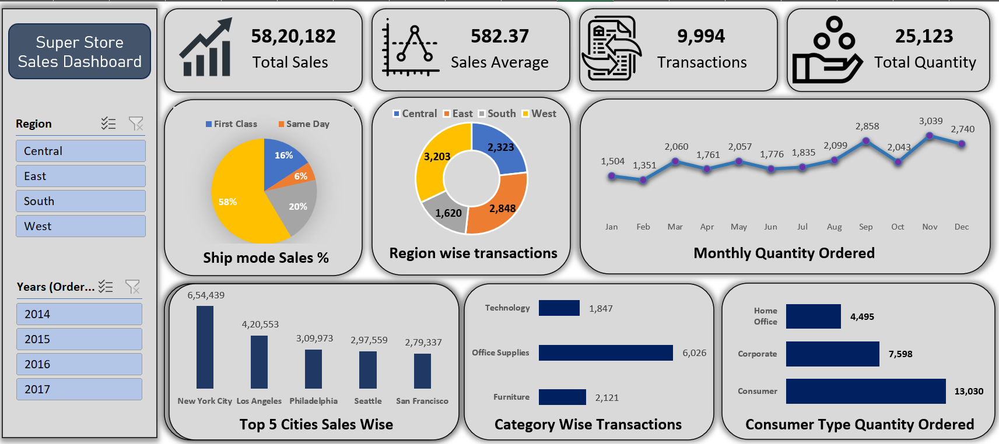

# Superstore Sales Dashboard in Excel

## Project Overview

This project presents an interactive sales dashboard built in Microsoft Excel using Superstore data. The dashboard helps users monitor sales performance across regions, product categories, and customer segments through KPIs, charts, and interactive filters.

## Project Objective

The objective of this project was to transform raw sales data into a clear, interactive dashboard that enables users to:

- Track overall sales performance
- Compare performance across regions and categories
- Analyze customer segments
- Explore yearly sales trends
- Make data-driven business decisions

## Tools and Techniques

- Microsoft Excel
- Power Query
- Pivot Tables
- Pivot Charts
- Slicers
- KPI reporting
- Data cleaning and transformation
- Data visualization

## Project Workflow

1. Imported the raw Superstore sales data into Excel.
2. Cleaned and transformed the data using Power Query.
3. Checked data types, missing values, and inconsistencies.
4. Created Pivot Tables to summarize business metrics.
5. Built Pivot Charts to visualize sales performance.
6. Added Year and Region slicers for interactive analysis.
7. Organized the KPIs and charts into a user-friendly dashboard.

## Dashboard Features

- Interactive Year and Region slicers
- Sales performance overview
- Regional performance analysis
- Category-level analysis
- Customer segment analysis
- Dynamic Pivot Tables and Pivot Charts
- KPI cards for quick performance monitoring

## Dashboard Preview

```markdown

```

## Repository Structure

```text
Excel_End_To_End_Project/
├── README.md
├── data/
│   └── superstore_data.csv
├── dashboard/
│   └── dashboard-preview.png
|   └── dashboard.xlsx
└── images/
```
```text
```

## How to Use the Dashboard

1. Download `Superstore-Sales-Dashboard.xlsx`.
2. Open the file in Microsoft Excel.
3. Enable editing if prompted.
4. Use the Year and Region slicers to filter the dashboard.
5. Review the KPIs and charts to compare sales performance.
6. Use **Data > Refresh All** if the source data has been updated.

## Skills Demonstrated

- Data cleaning and transformation
- Power Query workflow
- Pivot Table analysis
- Interactive dashboard development
- KPI reporting
- Business data visualization
- Sales trend analysis

## Author

**Janaki Ram Vallapu**  
Data Analyst | SQL | Power BI | Python | Excel

- [LinkedIn](https://www.linkedin.com/in/janakiramvallapu)
- [GitHub](https://github.com/janakiram-vallapu)
- [Email](mailto:janakiramvallapu@gmail.com)

## Feedback

Feedback and suggestions are welcome. If you find this project useful, consider giving the repository a star.
