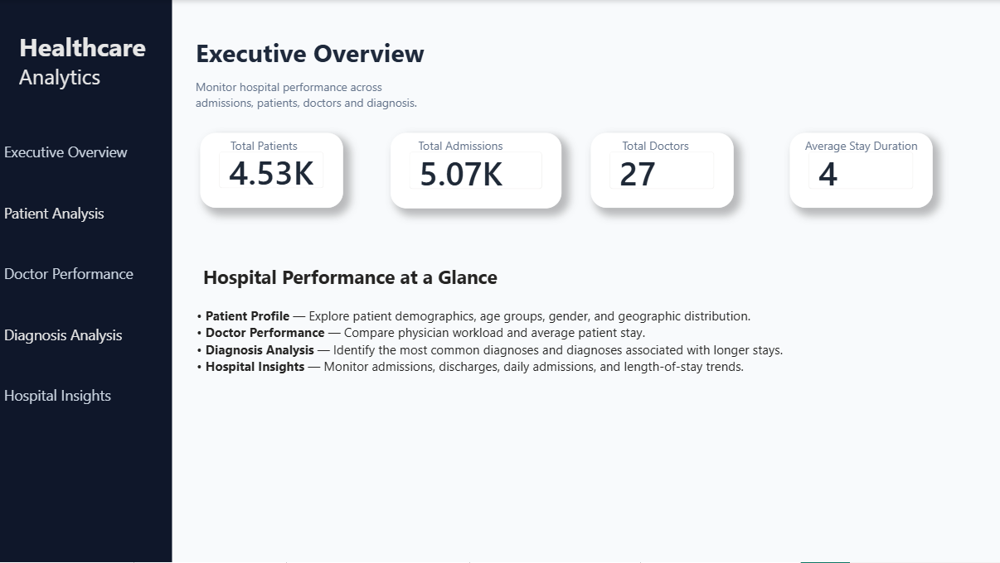

# Healthcare Analysis using SQL & Power BI

## Project Overview

This project demonstrates a full healthcare analytics workflow using SQL and Power BI. It focuses on patient demographics, hospital admissions, doctor performance, diagnosis trends, and hospital workload to uncover patterns useful for operational and clinical decision-making.

The project applies database setup, data cleaning, SQL analysis, and Power BI visualization to turn raw healthcare data into actionable business insights.

## Project Objectives

- Analyze patient and hospital demographics
- Study doctor performance and workload
- Measure admission and discharge patterns
- Review diagnosis trends and high-volume conditions
- Evaluate length of stay and patient profiles
- Build a healthcare dashboard for executive review

## Tools and Technologies

- MySQL
- MySQL Workbench
- SQL
- Power BI
- DAX
- Power Query
- Excel / CSV datasets

## Dataset

The project uses the following data sources:

- Patients
- Admissions
- Doctors
- Province Names

## SQL Concepts Demonstrated

- SELECT, WHERE, GROUP BY, HAVING
- CASE statements and aggregate functions
- JOINs and subqueries
- CTEs and window functions
- ROW_NUMBER, RANK, DENSE_RANK, LAG, LEAD
- Data cleaning and query optimization

## Dashboard Preview



## Repository Structure

```text
SQL_Healthcare_Analysis/
├── README.MD
├── Dataset/
│   ├── admissions.csv
│   ├── doctors.csv
│   ├── patients.csv
│   └── province_names.csv
├── SQL/
│   ├── 01_Database_Setup.sql
│   ├── 02_Data_Cleaning.sql
│   ├── 03_Constraints.sql
│   ├── 04_Assignment_Queries.sql
│   ├── 05_Business_Analysis.sql
│   └── 06_Advanced_Business_Analysis.sql
├── PowerBI/
│   └── Healthcare_Analysis.pbix
├── Images/
│   ├── Ececutive_Overview.png
│   ├── Patient_analysis.png
│   ├── Doctor_Performance.png
│   ├── Diagnosis_Analysis.png
│   └── Hospital_Insights.png
└── ...
```

## How to Use This Project

1. Import the data files from the Dataset folder into MySQL.
2. Run the SQL scripts in sequence to create the database and perform analysis.
3. Open the Power BI report in the PowerBI folder.
4. Use the dashboard filters to explore healthcare operations and performance trends.

## Skills Demonstrated

- SQL data analysis
- Database design and setup
- Data cleaning and transformation
- Business KPI calculation
- Power BI dashboard development
- DAX and visualization design
- Healthcare analytics reporting

## Author

**Janaki Ram Vallapu**  
Data Analyst | SQL | Power BI | Python | Excel

- [LinkedIn](https://www.linkedin.com/in/janakiramvallapu)
- [GitHub](https://github.com/janakiram-vallapu)
- [Email](mailto:janakiramvallapu@gmail.com)

## Feedback

Feedback and suggestions are welcome. If you find this project useful, consider giving the repository a star.
