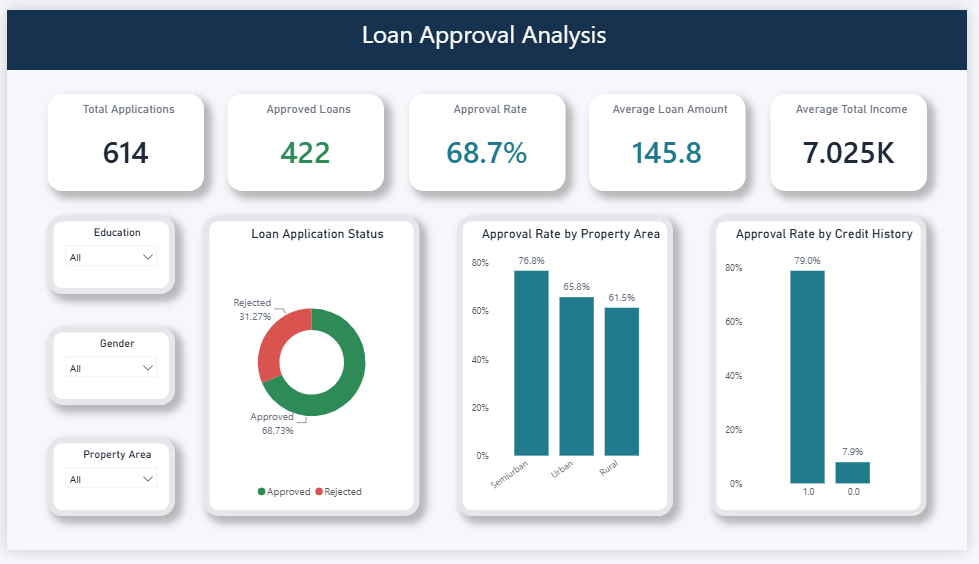

# Loan Approval Analysis

## Project Overview

This project analyzes loan application data using Python, SQL, and Power BI to understand the major drivers of loan approval and rejection. The goal is to identify patterns in applicant profile, income, credit history, and loan characteristics that influence decision outcomes.

The dataset contains 614 loan applications and enables analysis of both business and risk-related factors.

## Project Objectives

- Clean and validate the loan application dataset
- Handle missing and inconsistent values
- Explore approval patterns across applicant attributes
- Understand the role of income, credit score, and loan amount
- Build a structured Power BI data model
- Create DAX measures and KPI-driven visuals
- Communicate business performance through an interactive dashboard

## Tools and Technologies

- Python
- Pandas
- SQL
- Power BI
- DAX
- Power Query
- Jupyter Notebook

## Project Workflow

1. Imported the loan application dataset.
2. Cleaned and transformed the raw data using Python and Pandas.
3. Validated missing values and inconsistent records.
4. Conducted exploratory analysis of income, loan amount, and credit behavior.
5. Prepared the dataset for reporting and dashboard use.
6. Built a Power BI model and DAX measures.
7. Created an interactive dashboard with filters and KPIs.

## Analysis Areas

- Overall approval rate
- Applicant income distribution
- Credit history trends
- Loan amount patterns
- Demographic segmentation
- Approval vs rejection comparison

## Dashboard Features

- Interactive slicers and filters
- Approval-status KPIs
- Income and loan comparisons
- Credit history analytics
- Demographic breakdowns
- Power BI data model and DAX reporting

## Dashboard Preview



## Repository Structure

```text
Loan_Approval_Analysis/
├── README.MD
├── data/
│   ├── loan_approved.csv
│   └── loan_approved_clean.csv
├── python/
│   └── ...
├── sql/
│   └── ...
├── powerbi/
│   └── ...
├── images/
│   └── dashboard-preview.png
└── ...
```

## How to Use This Project

1. Review the Python workflow for data cleaning and analysis.
2. Open the SQL files if you want to reproduce the query-based analysis.
3. Open the Power BI dashboard file in the powerbi folder.
4. Explore the dashboard using slicers and breakdown charts.

## Skills Demonstrated

- Data cleaning and validation
- Exploratory data analysis
- Python and Pandas analysis
- SQL analysis
- Data modeling
- DAX measure creation
- KPI dashboard development
- Business reporting

## Author

**Janaki Ram Vallapu**  
Data Analyst | SQL | Power BI | Python | Excel

- [LinkedIn](https://www.linkedin.com/in/janakiramvallapu)
- [GitHub](https://github.com/janakiram-vallapu)
- [Email](mailto:janakiramvallapu@gmail.com)

## Feedback

Feedback and suggestions are welcome. If you find this project useful, consider giving the repository a star.
