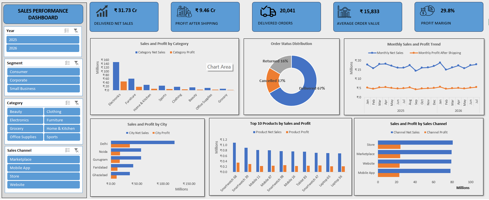

# Sales Performance Tracker — Interactive Excel Dashboard

The Sales Performance Tracker is an interactive Excel dashboard that transforms raw Delhi NCR sales data into clear insights on revenue, profitability, orders, products, cities, and sales channels.



## Features

- Cleaned sales dataset stored as an Excel Table
- Refreshable PivotTables and PivotCharts
- Five KPI cards for delivered-order performance
- Monthly sales and profit trend analysis
- Category, city, product, and sales-channel comparisons
- Delivered, cancelled, and returned order distribution
- Top 10 product analysis
- Interactive Year, Segment, Category, and Sales Channel slicers
- Connected filters across dashboard visuals
- Refresh-safe PivotTable formatting

## Dashboard

The summary dashboard provides an interactive view of overall sales performance and the main drivers behind it.

Dashboard KPIs include:

- Delivered Net Sales: **₹31.73 Cr**
- Profit After Shipping: **₹9.46 Cr**
- Delivered Orders: **20,041**
- Average Order Value: **₹15,833**
- Profit Margin After Shipping: **29.8%**

## Performance Analysis

The dashboard includes:

- Sales and Profit by Category
- Order Status Distribution
- Monthly Sales and Profit Trend
- Sales and Profit by City
- Top 10 Products by Sales and Profit
- Sales and Profit by Sales Channel

## Interactive Filters

The dashboard can be filtered by:

- Year
- Customer Segment
- Product Category
- Sales Channel

All slicers are connected to the relevant PivotTables and charts.

## Data Preparation

The raw dataset was reviewed and prepared before dashboard development.

Preparation steps included:

- Checking blank rows and duplicate order IDs
- Investigating missing delivery-day and customer-rating values
- Confirming that these missing values belonged to cancelled orders
- Validating dates and the January 2025–July 2026 reporting period
- Standardizing currency and percentage formats
- Verifying discount, sales, shipping-cost, and profit calculations
- Reviewing negative profit-after-shipping records
- Checking text fields for inconsistent values
- Converting the cleaned range into an Excel Table

## Key Calculations

Average Order Value:

```text
Delivered Net Sales / Delivered Orders
```

Profit Margin After Shipping:

```text
Profit After Shipping / Delivered Net Sales
```

Profit After Shipping:

```text
Gross Profit - Shipping Cost
```

## Key Findings

- Electronics generated the highest delivered net sales among product categories.
- Delhi led all cities in delivered sales, profit after shipping, and order volume.
- Store was the strongest sales channel by delivered sales, profit, and orders.
- `Smartwatch 68` ranked first by delivered net sales and also generated the highest profit among the Top 10 products.
- Some orders became loss-making after shipping costs, showing the importance of monitoring post-shipping profitability.

## Technology Used

- Microsoft Excel
- Excel Tables
- PivotTables
- PivotCharts
- Slicers and report connections
- Basic formulas
- Custom number formatting
- Data cleaning and validation

## Workbook Structure

| Sheet | Purpose |
|---|---|
| `SalesData` | Cleaned source data stored as an Excel Table |
| `Pivot_Report` | Supporting PivotTables and KPI calculations |
| `Summary_Dashboard` | KPI cards, charts, and interactive slicers |

## How to Use

1. Download `Sales_Performance_Tracker.xlsx`.
2. Open it using the desktop version of Microsoft Excel.
3. Open the `Summary_Dashboard` sheet.
4. Use the slicers to explore performance by year, segment, category, and channel.
5. Use each slicer's clear-filter button to return to the complete view.
6. Select **Data > Refresh All** after updating the source data.

## Repository Files

```text
Sales_Performance_Tracker/
|-- README.md
|-- Sales_Performance_Tracker.xlsx
|-- Sales_Data.xlsx
`-- images/
    `-- Dashboard.png
```

## Current Limitations

- The headline financial KPIs are intentionally based on delivered orders.
- Advanced measures such as sales-representative performance, discount-band analysis, and customer-rating trends are not displayed on the summary dashboard.
- PivotTables and slicers work best in the desktop version of Microsoft Excel.

## Author

**Janakiram**  
Data Analytics and Excel Dashboard Portfolio Project
