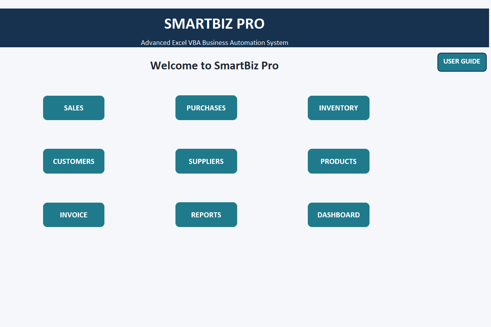
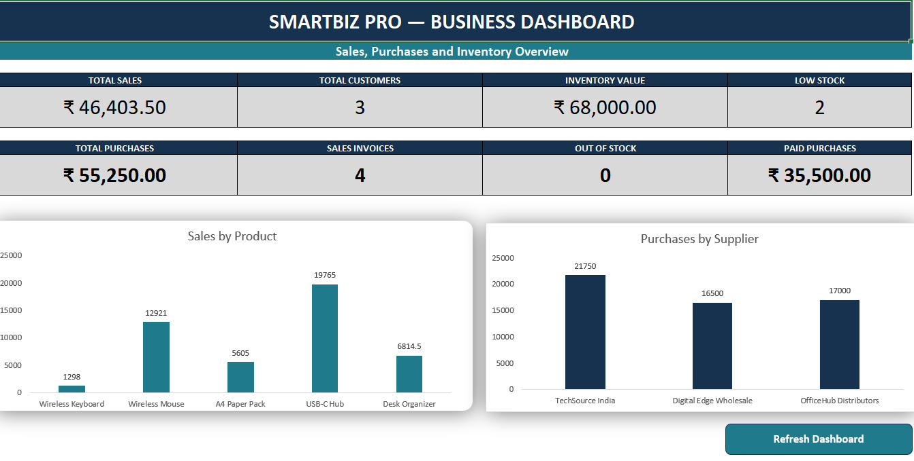
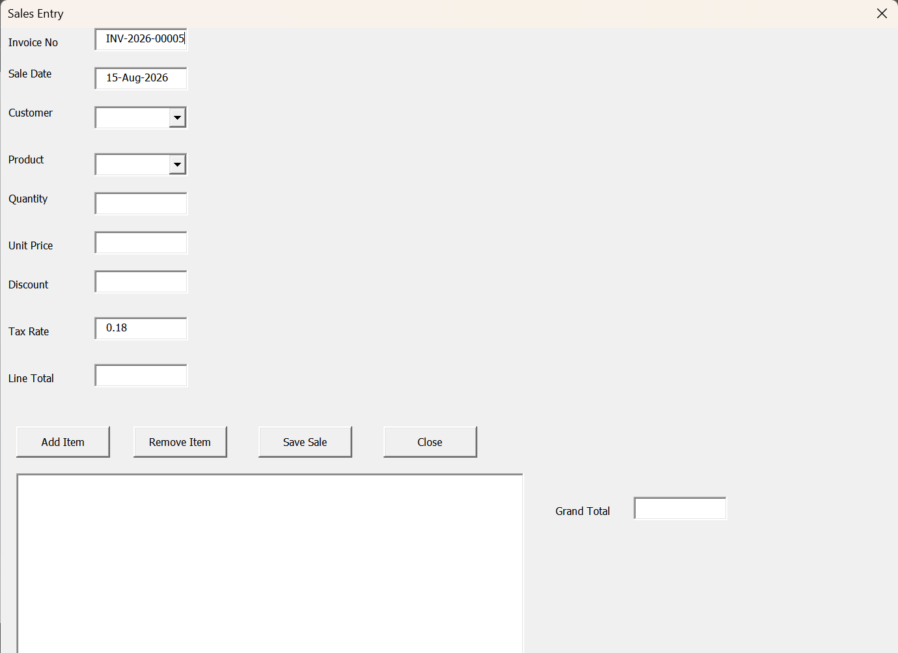
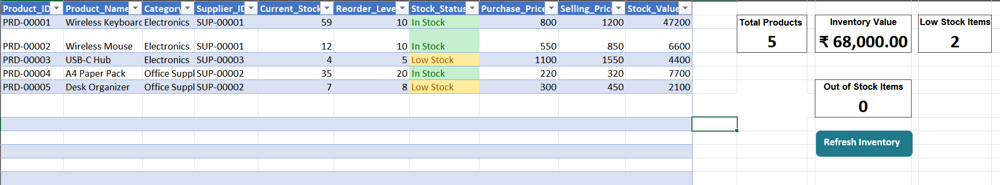

# SmartBiz Pro — Excel VBA Business Automation System

SmartBiz Pro is a macro-enabled Excel application that automates core small-business operations, including product management, purchases, sales, inventory tracking, invoicing, dashboards, and reporting.

## Features

- VBA UserForms for products, customers, suppliers, purchases, and sales
- Automatically generated record IDs and invoice numbers
- Multi-item sales transactions
- Automatic inventory increases after purchases
- Automatic inventory reductions after sales
- Low-stock and out-of-stock alerts
- Customer invoice generation from selected sales records
- One-page PDF invoice export
- Live KPI dashboard
- Sales-by-product and purchases-by-supplier PivotCharts
- Operational Report Center
- In-workbook User Guide

## Dashboard

The dashboard summarizes key business metrics and refreshes inventory, formulas, PivotTables, and charts through a single VBA button.

Dashboard metrics include:

- Total sales
- Total customers
- Inventory value
- Low-stock items
- Total purchases
- Unique sales invoices
- Out-of-stock items
- Paid purchases

## Sales Automation

The Sales Entry form supports multiple products within one invoice. It calculates discounts, tax, line totals, and the invoice grand total while updating product stock.

## Inventory Management

Inventory is generated from the product database and displays current stock, reorder levels, stock status, pricing, and inventory value.

Stock statuses are visually classified as:

- In Stock
- Low Stock
- Out of Stock

## Invoice Automation

A selected sales record can generate a formatted customer invoice. All sales rows sharing the same invoice number are combined into one invoice.

Invoices can be exported automatically as one-page PDF documents.

## Technology Used

- Microsoft Excel
- VBA
- UserForms
- Excel Tables
- PivotTables and PivotCharts
- Structured-reference formulas
- Conditional formatting
- PDF export automation

## Typical Workflow

1. Enable macros when opening the workbook.
2. Configure company information.
3. Add suppliers, customers, and products.
4. Record purchases to increase stock.
5. Record sales to reduce stock.
6. Generate an invoice from a selected sales record.
7. Export the invoice as a PDF.
8. Refresh the dashboard and review operational reports.

## How to Run

1. Download `SmartBiz_Pro_v1.0.xlsm`.
2. Open it using the desktop version of Microsoft Excel.
3. Click **Enable Content** when the macro security warning appears.
4. Start from the `HOME` sheet.

> Only enable macros in files obtained from a trusted source.

## Current Limitations

- Each generated invoice supports up to 10 product lines.
- Payment status, payment method, and invoice notes are not currently stored in sales records.
- VBA macros require the desktop version of Microsoft Excel and do not run in Excel for the web.

## Demo Data

The workbook includes fictional demonstration records created solely to showcase the application’s features.

## Author

**Janakiram**  
Data Analytics and Excel VBA Portfolio Project